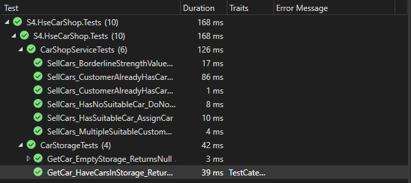
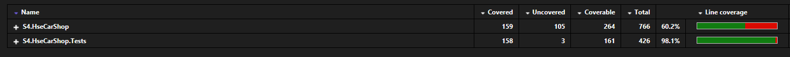

# 🔬 Исправление тестов

Все тесты теперь **исправно работают**. В некоторые тесты также добавлена соответсвующая для гибридного автомобиля логика.
Однако, совсем новые тесты (свои прям) не добавлены, адаптированы только имеющиеся. Код имеет очень сложную архитектуру,
охватить его тестами тяжело, многие готовые "строители" мок объектов типо Fixture требуют дополнительной настройки, от чего, по
моему мнению, уменьшается читаемость тестов, поэтому там, где Fixture не справлялся (например, для корректного создания carShop)
, я заменил его на обычные конструкторы.

Причем, процент покрытия тестами получился хороший: 60%, такой же у нас требуется для обычного мини ДЗ, так что думаю
что код достаточно покрыт тестами.
