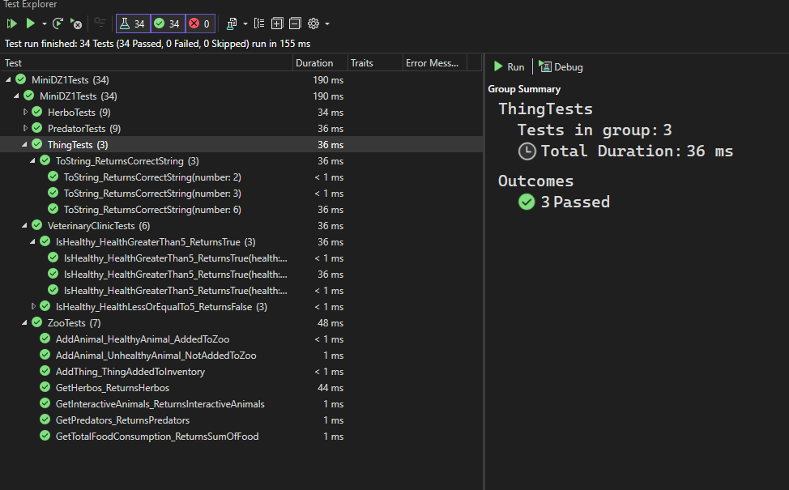
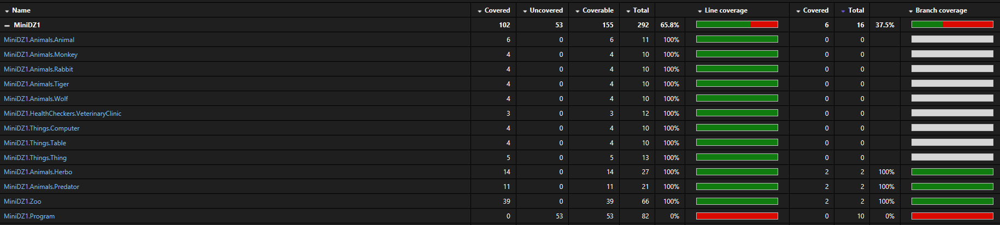

# ❗Файл решения (.sln) находится в папке MiniDZ1❗

# Описание решения

## Animals :monkey_face: :rabbit: :tiger:  :wolf: 

### Animal
Абстракный класс Animal, который 
наследуется от интерфейсов IAlive, 
IInventory, и, соответственно, имеет поля 
Food, Health, Number. Также дополнительно имеются поля SpecieName
и Nickname. Олицитворяет животное.

+ Food - количество еды, которое животное съедает за один день
+ Health - здоровье животного
+ Number - номер животного (для инвентаризации). По умолчанию равен -1.
+ SpecieName - название вида животного
+ Nickname - кличка животного

### Herbo
Абстракный класс Herbo, который наследуется от Animal и дополнительно
имеется поле Kindness и метод IsInteractive. Олицитворяет травоядное животное.

+ Kindness - доброта животного. Согласно заданию, может быть от 0 до 10, бросает
ArgumentException, если переданное в конструктор значение не входит в этот диапозон.
+ IsInteractive() - метод, который возвращает true, если животное дружелюбное, иначе false

Также преопределен метод ToString(), который возвращает строку со всей информацией о животном.

### Predator
Абстрактный класс Predator, который наследуется от Animal и дополнительно
имеется поле Aggressiveness. Олицитворяет хищное животное.

+ Aggressiveness - агрессивность животного. Фактической пользы не несет и используется только для вывода информации о хищниках
, но позволяет хотя бы разделить травоядных животных 
от хищников различием параметров (Kindness vs Aggressiveness), чтобы был смысл реализовать два разных абстракных класса, согласно заданию. Также по заданию, может быть только от 0 до 10, бросает
ArgumentException, если переданное в конструктор значение не входит в этот диапозон.

Также преопределен метод ToString(), который возвращает строку со всей информацией о животном.

### Monkey, Rabbit, Tiger, Wolf
Классы, которые наследуются от Herbo и Predator соответственно их виду. Также классы заранее
определены параметром SpecieName для каждого животного.
Олицитворяют конкретные виды животных.

 

## HealthCheckers :hospital:

### IAnimalHealthChecker
Интерфейс IAnimalHealthChecker, который содержит метод CheckHealth(Animal), который проверяет здоровье животного.

### VeterinaryClinic
Класс VeterinaryClinic, который реализует интерфейс IAnimalHealthChecker. По факту,
мог бы содержать и другие методы/поля, но, в данном случае, реализован только метод интерфейса. Он нужен для корректной работы класса Zoo и
соблюдения SOLID принципов (о соблюдении ниже). Абстракция ветеринарной клиники.

 

## Things :package:
### Thing
Абстрактный класс Thing, который наследуется от интерфейса IInventory и имеет поля Name и Number (по умолчанию -1). 
Абстракция вещи.

### Table, Chair
Классы, которые наследуются от Thing и определяют конкретные вещи. Каждой из них назначено соответствующее  название вещи
в поле Name.

 

## Zoo :deciduous_tree:
Класс Zoo представляет собой основную сущность зоопарка, которая управляет учетом животных и вещей.
Зоопарк ведет инвентаризацию, взаимодействует с ветеринарной клиникой и предоставляет информацию о своих обитателях.

**Поля:**
+ _healthChecker - объект IAnimalHealthChecker, который проверяет здоровье животных перед их добавлением в зоопарк.

+ _animals - список животных, содержащихся в зоопарке.

+ _inventory - список вещей, находящихся на балансе зоопарка.

+ NextNumber - следующий доступный инвентаризационный номер.

**Методы:**
+ AddAnimal(Animal animal) - добавляет животное в зоопарк, если оно прошло проверку здоровья,
присваивая ему инвентарный номер и увелечивая _nextNumber. Выводит текстовое сообщение о результате добавления.

+ AddThing(Thing thing) - добавляет новый объект в инвентарный список зоопарка, присваивая ему инвентарный номер и увелечивая _nextNumber. 
Выводит текстовое сообщение о результате добавления.

+ GetTotalFoodConsumption() - возвращает общее количество еды, необходимое всем животным зоопарка в сутки.

+ GetAllAnimals() - возвращает список всех животных в зоопарке.

+ GetHerbos() - возвращает список всех травоядных животных, содержащихся в зоопарке.

+ GetInteractiveAnimals() - возвращает список дружелюбных травоядных, которых можно поместить в контактный зоопарк.
Использует метод IsInteractive() из класса Herbo.

+ GetPredators() - возвращает список всех хищников, содержащихся в зоопарке.

+ GetInventory() - возвращает список всех вещей, находящихся на инвентарном учете.

 

## Program :computer:
Здесь происходит демонстрация работы всех классов и методов. Создаются объекты зоопарка, животных, вещей, ветеринарной клиники и производятся все возможные действия с ними
(при этом зоопарк и ветеринарная клиника связана по средствам DI контейнера).
Сначала добавляются травоядные животные, затем хищники, затем вещи. Далее выводится информация о всех животных, вещах, общем количестве еды, дружелюбных животных и хищниках.
Порядок добавления может быть любым, изменится только порядок вывода информации и их номер инвентаризации. Можно поменять добавляемые объекты, чтобы отследить поведение программы.

С лектором было обговорено, что ввод данных через консоль можно не добавлять, так как это не является частью задания.
Достаточно вывода, а вся информация о животных и вещах задается в коде.

 

# SOLID

## S – Single Responsibility Principle (Принцип единственной ответственности)
Каждый класс выполняет только **одну**(свою) задачу:

+ Zoo – управляет животными и инвентарем (отвечает за бизнес логику зоопарка).
+ VeterinaryClinic – отвечает за проверку здоровья животных.
+ Animal, Herbo, Predator – базовые классы для моделирования животных. 
+ Thing – базовый класс для предметов инвентаря.

(тоже касается и конкретных реализаций, таких как, например, Monkey или Table).

Это обеспечивает разделение обязанностей, предотвращая перегруженность классов.

## O – Open/Closed Principle (Принцип открытости/закрытости)
Система легко расширяется, но не модифицируется:

+ Можно добавить новых животных, просто унаследовав их от Herbo или Predator.
+ Можно создать новые виды вещей, унаследовав их от Thing.
+ Можно внедрить новую систему проверки здоровья, реализовав IAnimalHealthChecker.
+ Все это можно сделать без изменения существующего кода.

## L – Liskov Substitution Principle (Принцип подстановки Барбары Лисков)
Все подклассы могут заменять родительские классы без нарушения логики:

+ Rabbit, Monkey корректно работают там, где ожидается Herbo.
+ Tiger, Wolf корректно работают там, где ожидается Predator.
+ Table, Computer корректно работают там, где ожидается Thing.

## I – Interface Segregation Principle (Принцип разделения интерфейса)
Интерфейсы разделены по конкретным обязанностям:

+ IAlive – для живых существ.
+  IInventory – для инвентаря.
+ IAnimalHealthChecker – отвечает только за проверку здоровья животных.

## D – Dependency Inversion Principle (Принцип инверсии зависимостей)
Зоопарк не зависит от конкретной реализации клиники, а работает с интерфейсом IAnimalHealthChecker.
Это позволяет заменять проверяющий сервис без изменения кода Zoo (например, возможно услуги проверки здоровья животных будет предоставлять частный вет. врач. ).

 

# DI контейнер
В данной программе использован DI контейнер, который связывает интерфейс IAnimalHealthChecker с его реализацией VeterinaryClinic.
Это позволяет легко заменить реализацию интерфейса, не меняя код класса Zoo. Zoo при это создается при вызове GetRequiredService().

 

# Тестирование
Для тестирования был создан MiniDZ1Test. Тесты написаны с использованием Moq и xUnit.

Программа успешно проходит написанные мной тесты.

Для подсчета процента покрытия тестами использовалось расширение Fine Code Coverage для Visual Studio. 

Получается, что покрытие тестами составляет **65.6%**, по заданию требуется не менее 60%.
Тестами не покрыт только Program.cs, который производит демонстрацию работы моего мини дз.

Также, стоит отметить, что тут 37.5% Branch Coverage, но я так понимаю, что по заднию нужно именно Line Coverage.
Branch Coverage я и поправить особо не могу, ведь здесь ожидается, что я буду также ловить и проверять все Exception,
в том числе связанные с созданием DI контейнера.
