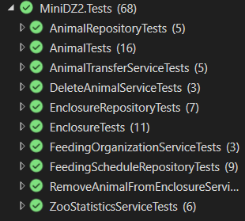
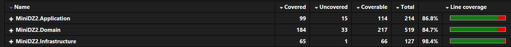

# 🦁 Мини ДЗ 2. Web-приложение для автоматизации бизнес-процессов зоопарка

---

## 📌 1. Реализованный функционал

Для работы с приложением нужно пользоваться API запросами. Документация к ним предствалена по адресу [https://localhost:7123/swagger/](https://localhost:7123/swagger/)

 

### 🦫 Животные
- Возможность добавлять и удалять животных. Причем удаление животного при API запросе происходит
с помощью специального сервиса `DeleteAnimalService`, чтобы удалить данные о животном также из связанных объектов.
Например, удалить все расписания кормления животного, а также удалить данные о животном из объекта вольер.
- Возможность получить всех животных или конкретное животное по id.
- Животное можно кормить (как напрямую, так и с помощью расписания) и лечить, и наоборот, помечать голодным или больным.
- Животное можно разместить в вольер (или переместить в другой вольер). Перемещение происходит с помощью сервиса
`AnimalTransferService`, который убирает животное из одного вольера и переносит в другой, при этом с помощью `Enclosure.AddAnimal()` проверяет, что вольер не переполнен, что животные совместимы по видам, а также, что 
животное уже не находится в вольере. Этот сервис также вызывает событие `AnimalMovedEvent`, которое обрабатывается в `AnimalMovedEventHandler` и выводит сообщением об этом в консоль.
- Животное имеет следующие поля: id, вид, кличка, дата рождения, пол, любимая еда, статус (здоров/болен), голоден ли
, а также идентификатор вольера, в котором оно находится. Для удобства валидации многие поля предствалены в качестве **ValueObjects**.

### ▦ Вольер
- Возможность добавлять и удалять вольеры. Удаление вольера убирает также всех животных из него.
- Возможность получить все вольеры, конкретный вольер по id или вольер по id животного.
- Возможность почистить клетку или отметить её грязной.
- Вольер имеет следующие поля: id, тип (птицы, млекопитающие и т.д.), размер, текущее количество животных, максимальное количество животных, а также список животных в вольере. Для удобства валидации некоторые поля предствалены в качестве **ValueObjects**.

### 📅 Расписание кормления
- Возможность добавлять и удалять расписания кормления.
- Возможность получить все расписания кормление, конкретное расписание по id или расписание по id животного.
- Возможность покормить всех животных по расписанию (по конкретной дате). При этом вызывается `FeedingTimeEvent`, который
обрабатывается с помощью `FeedingTimeEventHandler`, выводит сообщение в консоль и использует `FeedingOrganisationService` для кормления.
- Расписание кормления имеет следующие поля: id, идентификатор животного, дата кормления, еда, выполнено ли кормление. Для удобства валидации некоторые поля предствалены в качестве **ValueObjects**.

Вообще, по заданию событие `FeedingTimeEvent` должно было вызываться, когда наступает время кормления, но для удобства проверки и тестирования он вызывается по команде для определенной даты,
вместо того, чтобы каждый раз проверять дату и время и вызывать событие во время работы приложения.

### 📊 Статистика
- Возможность получить общее количество животных в зоопарке
- Возможность получить количество здоровых животных
- Возможность получить количество больных животных
- Возможность получить общее количество вольеров
- Возможность получить количество вольеров с доступными местами
- Возможность получить общее количество записей в расписании кормлений

Все запросы выполняются через `ZooStatisticsService`. 

---

## :book: 2. Применение концепций DDD и Clean Architecture

### Domain-Driven Design (DDD)

**1. Value Objects**  
Не имеют уникального идентификатора, но используются для валидации данных.
- `AnimalName`, `Species`, `Food`, `BirthDate`, `Status`, `Gender` и другие
   → Находятся в папке `MiniDZ2.Domain/ValueObjects`

**2. Entities**  
Каждая сущность уникальная и имеет идентификатор:
- `Animal`, `Enclosure`, `FeedingSchedule`
   → Находятся в папке `MiniDZ2.Domain/Entities`

**3. Domain Events**  
- `AnimalMovedEvent`
   → Обработка: `AnimalMovedEventHandler`
- `FeedingTimeEvent`
   → Обработка: `FeedingTimeEventHandler`

 События используют `MediatR` для обработки и инъекции зависимостей.

**4. Repositories** 
- Интерфейсы: `IAnimalRepository`, `IEnclosureRepository`, `IFeedingScheduleRepository`
      → Реализация в `Infrastructure/Repositories`

 

### Clean Architecture

- **Domain Layer**  
  Хранит Entities, Events и ValueObjects (`MiniDZ2.Domain/`)

- **Application Layer**  
   Хранит EventHandlers и Services, которые реализуют бизнес-логику приложения (`MiniDZ2.Application/`)

- **Infrastructure Layer**  
  Репозитории для доступа к данным (in-memory) (`MiniDZ2.Infrastructure/`)

- **Presentation Layer (API)**  
  Контроллеры для взаимодействия с пользователем по средствам API и DTO для перевода данных в Domain сущности (`MiniDZ2.Presentation/`)

В проекте соблюдены следующие принципы:
a. Слои зависят только внутрь (Domain не зависит ни от чего) 
a. Все зависимости между слоями через интерфейсы
a. Бизнес-логика полностью изолирована в Domain и Application слоях 

---
### 🧪 3. Тестирование

Проект тестировался с помощью `xUnit` и `Moq`. Тесты находятся в `MiniDZ2.Tests`.
 

Все тесты **пройдены**.

Тестами покрыто **более 65% процентов кода**, как требовало задание. При этом Presentation слой тестировался с помощью Swagger, тоже как и требовалось в задании.

